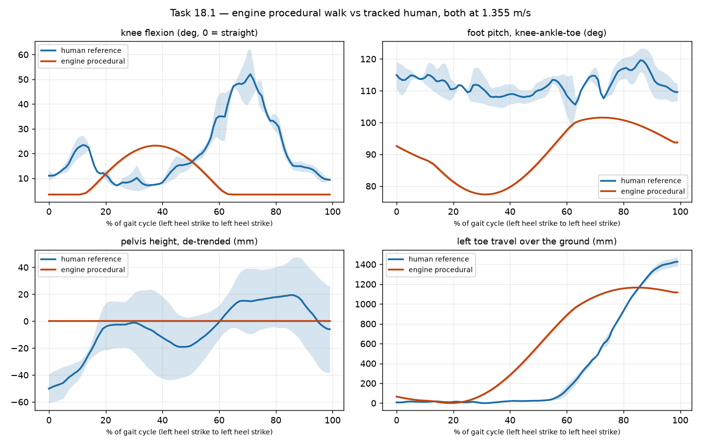

# Task 18.1 — the walk we ship, measured against a real human

**Session:** motion capture · **Date:** 2026-08-21 · **Branch:** `claude/mocap-from-video`

Nobody had ever checked whether the engine's procedural walk is any good. This makes it a
number. Both sides are driven at **the same measured speed, 1.355 m/s**, and both go through
one metric implementation (`tools/mocap/gait_metrics.py`), so a difference below is a
difference in the motion and not in how the two were measured.

**Reproduce:**

```
./build/tools/mocap/mge_gait_dump --speed 1.355 --fps 60 --seconds 8 --out build/engine_walk.json
python3 tools/mocap/gait_compare.py \
    --reference assets/mocap/walk_reference_tracking.json.gz \
    --engine build/engine_walk.json \
    --figure docs/research/procedural-walk-vs-human.png
```

---

## 1. The pipeline was validated before it was believed

18.1 exists partly to check the tracking-to-comparison path against a motion we can already
produce. Two independent checks say it works, and both are worth more than the headline
numbers because everything else rests on them.

**The measurement recovers the engine's own stride constant.** `LocomotionAnimator` computes
`stride = 0.75 + 0.85 * clamp(speed/runSpeed, 0.15, 1)`, which at 1.355 m/s is **1.0379 m**.
Measured from detected foot plants in the ground frame, knowing nothing of that formula:
**1.0378 m.** Four decimal places, through contact detection, ground framing and averaging.

**The contact detector agrees with the animator's internal phase.** The engine's cycle starts,
found geometrically, land at animator phase 0.531, 0.532, 0.533, 0.534, 0.534 — stable to
±0.003 of a cycle across nine cycles.

**And on the human side the two detectors agree with each other.** Speed-based stance for the
left foot is frames 0–29, 58–92, 121–137; the independent height-based detector gives 0–31,
49–95, 118–135.

The reference numbers also land where the gait literature puts a casual adult walk — duty
factor 0.60, step width 95 mm, pelvis bob 46 mm, cadence 119 steps/min at 1.355 m/s. That is
not a validation, but a pipeline that disagreed with all four would not deserve the benefit of
the doubt.

## 2. What the reference is

`assets/mocap/walk_reference_tracking.json.gz`, 436 frames at 60 fps, three simultaneous views.
The take contains a standing start and a stop, so measurement is restricted to the
**steady-walking window, frames 154–291 (2.30 s)**, chosen by cycle-smoothed hip velocity. Over
that window a straight line fits the hip's forward travel with a **24.7 mm** residual.

Image scale is **199.8 px/m (cv 5.8%)**, calibrated from the subject's own torso segments —
there is no calibration object in frame, and the film itself is not in the repo.

## 3. The comparison

● Real output. Engine side is `LocomotionAnimator` itself, linked and run, not a model of it.

```
metric                     unit           human     engine   difference
------------------------------------------------------------------------------
walking speed              m/s            1.355      1.355   +0%     (driven to match)
cadence                    steps/min      119.0      156.5   +32%
step time                  s              0.504      0.383   -24%
stride (from travel)       m              1.366      1.039   -24%
stride (from contacts)     m              1.440      1.038   -28%
stance time L              s              0.583      0.067   -89%
stance time R              s              0.617      0.067   -89%
duty factor                               0.595      0.087   -85%
double support             share          0.130      0.000   -0.130 abs
airborne                   share          0.000      0.858   +0.858 abs
vertical bob p2p           m             0.0462     0.0000   -100%
vertical bob rate          Hz              1.74       0.12   -93%
slide, foot down           m             0.2506     0.6141   +145%
slide, mid-stance          m             0.0421     0.2358   +461%
min foot speed in contact  m/s            0.033      0.132   +301%
step width mean            m             0.0950     0.3540   +273%
step width swing           m             0.0663     0.0000   -100%
pelvis yaw p2p             deg             21.0        0.0   -100%
shoulder yaw p2p           deg             33.4        4.9   -85%
girdle correlation                       -0.207      0.000   +0.207 abs
```



## 4. Findings, worst first

**F1 — the feet slide, and the guarantee we thought covered it does not.**
`LocomotionAnimator::update` carries the comment *"Phase is distance-driven (speed \* dt /
stride): standing still freezes the cycle, so feet never slide."* The first clause is true and
the measurement confirms it. **The second does not follow from it.** Distance-driving
guarantees the cycle does not advance while the character is stationary; it says nothing about
whether a foot stays put *within* a cycle, and it does not.

Through mid-stance — the part of the cycle where a foot must be still — the engine's foot
travels **236 mm against the human's 42 mm**. Its slowest moment while in ground contact is
**0.132 m/s**, about a tenth of walking speed; the human's is 0.033 m/s, which is roughly the
estimator's own noise floor. The bottom-right panel shows it plainly: the human's toe holds a
flat plateau for the first third of the cycle, and the engine's has no plateau at all.

Reading the curve gives the precise version: the engine's foot is genuinely still for roughly
the first 20% of the cycle, keeps sliding for the remaining ~30% of its ground contact, and is
then stationary again *while airborne* between 85% and 100%. The foot is planted at the wrong
times.

This is task 18.4's problem statement, now with a number attached, and it is the one to fix
first — it is the defect a player sees without being able to name it.

**F2 — the knee flexes at the wrong moment, not merely too little.**
Range of motion is 19.8° against a human 59.5–78.6°, so about a third. But the timing is the
bigger fault. The human curve is the familiar double bump: **23° of stance flexion at 12% of
the cycle, then 52° of swing flexion at 71%.** The engine produces **one** bump — 23° at 37%,
which is close to the human's *stance* magnitude placed in the middle of the cycle — and it is
fully extended at 71%, exactly where a human knee is at maximum bend.

So the fix is not "increase the swing constant". The engine is missing the swing-phase knee
flexion entirely, and what it does have is a third of a cycle out of phase.

**F3 — there is no vertical movement of the body at all.**
Bob is **exactly 0.000 m**, and it is zero by construction rather than by tuning: `Pose` carries
rotations only, the `Hips` joint sits at a constant bind offset, and `evaluatePose` therefore
places the root at the same height on every frame. A human's pelvis rises and falls **46 mm
peak-to-peak, twice per stride** (measured 1.74 Hz against a 1.98 Hz step rate; the FFT bin is
0.43 Hz wide over a 2.3 s window, so that is the same number).

This is the one finding that is a **capability gap rather than a tuning error**, and it matters
beyond the walk: a captured clip *will* contain vertical root motion, and there is currently
nowhere in `Pose` to put it. Raised in `docs/status/mocap.md` under `Needs:`.

**F4 — the cadence is 32% too fast because the stride is 28% too short.**
At 1.355 m/s the engine takes **156.5 steps/min** where the human takes **119.0**, because its
stride is **1.038 m** against **1.37–1.44 m**. Speed is right by construction, so the error is
entirely in the trade between stride and cadence. The constant is visible in the source:
`stride = 0.75 + 0.85 * blend` with `blend = 0.339` at this speed. A real 1.75 m adult walking
at 1.355 m/s takes strides of about 1.4 m.

**F5 — the stance is far too wide, and the feet never move sideways.**
Ankle separation is a constant **354 mm** against a human **95 mm**, and its variation over the
cycle is **exactly zero** against a human 66 mm. The width comes from the bind pose, where the
template's legs splay outward to the ankle — that is the authored stance of the imported body
and is not itself a bug — but locomotion never brings the feet toward the midline, which a
walking human does on every step.

**F6 — the pelvis does not rotate at all, and the shoulders barely do.**
The engine twists `Spine` and `Chest` about Y (±0.08 and ±0.05 rad, scaled by blend), which
measures as **4.9° of shoulder yaw**. The pelvis measures **0.0°** — `Hips` is never rotated,
so nothing below the spine turns. The human shows counter-rotation (girdle correlation −0.21:
the two girdles move in opposite directions) which the engine cannot show at all, since a
signal that is identically zero correlates with nothing.

**The amplitude of the human's girdle rotation is not yet trustworthy, and I would rather say
so than quote it.** Across the three views the same quantity measures 7.8°, 21.0° and 30.4° for
the pelvis and 5.7°, 33.4° and 35.5° for the shoulders — a spread of about 4x. Girdle yaw
depends on the depth axis, which is the weakest axis of a single-view landmark estimator, and
this is exactly what triangulation (18.2) is for. **What is solid is the sign and the
structure** — the human counter-rotates on all three views, and the engine does not rotate its
pelvis on any.

## 5. What this does NOT yet settle — ADR 0020's revisit trigger

ADR 0020 declined the clavicle and named the condition for revisiting it: *when the mocap
front-end exists and we can measure how much girdle motion real captures carry.*

**That condition is not met yet, and this measurement should not be read as meeting it.** The
4x spread in section F6 is larger than the difference any clavicle decision would turn on. The
honest position after 18.1 is that the reference contains girdle counter-rotation of the right
sign and plausible magnitude, and that its size will not be known until 18.2 triangulates the
three views into one metric skeleton and 18.3 resolves it into rotations that either fit the
17-joint rig or visibly do not.

**The rig freeze is not threatened by anything measured here.** Recorded so the next session
does not have to re-derive it.

## 6. Measurement limits, stated rather than buried

- **Window choice.** Widening the steady window from 2.30 s to 3.13 s moves the human's speed
  from 1.355 to 1.309 m/s (3%), cadence 119.0 to 116.9 (2%), stride 1.440 to 1.409 (2%), duty
  factor 0.595 to 0.593, bob 46.2 to 49.4 mm. No finding above depends on the choice; run
  `--window-fraction` to reproduce.
- **Only about 2 full gait cycles** of the human are inside the steady window, against 9 for the
  engine. The shaded bands in the figure are the spread across those cycles and are honest
  about it.
- **Foot heights carry roughly ±20 mm.** After fitting the floor as a line in forward position
  — necessary, because the apparent floor drifts **94.9 mm** across the traverse — the two feet
  still disagree about where the floor is by about 20 mm. Stride, cadence, bob, knee angle and
  slide do not depend on this; absolute foot clearance would, so it is not claimed.
- **Foot pitch is the least reliable row in the table** and no finding rests on it. The human's
  own three views disagree by 17.4–47.1°, the toe landmark is the least visible one on the
  weakest view, and on the engine side there is **no toe joint at all** — the rig's leg chain
  ends at `Foot`, which is the ankle, so the comparison uses a synthetic toe projected along the
  foot joint's own orientation. Its direction is meaningful; its absolute pitch is not.
- **Girdle rotation amplitude** is unresolved to about 4x, per section F6.

## 7. What follows

The engine's walk is wrong in five measurable ways and one of them (F3) cannot be fixed without
a contract change. None of that blocks the capture pipeline — 18.2 through 18.5 are unaffected —
and F1's detector is the same machinery 18.4 needs, now written and validated against a known
quantity, which is what 18.1 was for.

Fixing the procedural walk itself is **not** this session's call to make unilaterally:
`LocomotionAnimator` lives in `engine/src/character/humanoid.cpp`, which the character asset
pipeline owns. The findings are handed over in `docs/status/mocap.md`, with the tools to
re-measure any fix.
